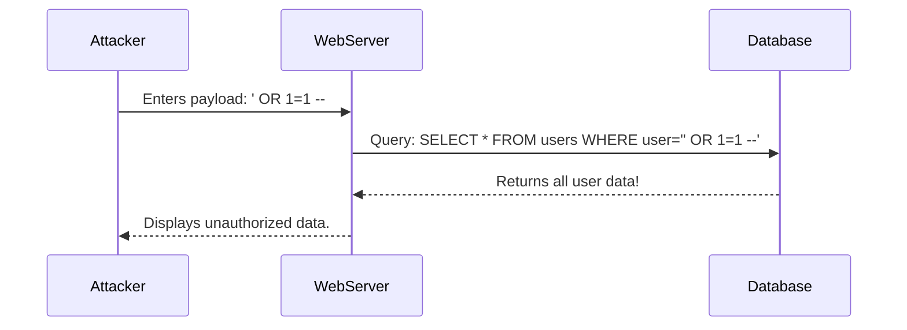

# 🕸️ Module 03: Web Application Security

Web applications are the most common attack surface for modern hackers. We will focus on the **OWASP Top 10**.

---

## 🎯 Top Vulnerabilities

| Vulnerability | How it Works | Prevention Strategy |
| :--- | :--- | :--- |
| **Broken Access Control** | Users act outside of their intended permissions. | Implement role-based access control (RBAC). |
| **Injection (SQLi)** | Untrusted data is sent as a database query. | Use Prepared Statements. |
| **Cross-Site Scripting** | App includes untrusted data in a web page. | Input validation and escaping. |

---

## 💥 How an SQL Injection Works

---
⬅️ **[Back to Module 02](../02-Network-Security/README.md)** | ➡️ **[Proceed to Module 04](../04-Ethical-Hacking-Labs/README.md)**
