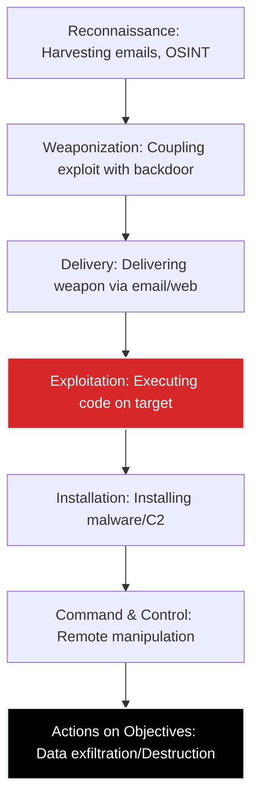

# 💻 Module 04: Advanced Penetration Testing Methodology

Professional ethical hacking is not random. It relies on structured methodologies. In this module, we explore the frameworks used by Red Teams and Advanced Persistent Threats (APTs).

---

## ⚔️ The Cyber Kill Chain

Developed by Lockheed Martin, this framework describes the stages of a targeted cyber attack. Defenders use this to break the chain and stop the attack at any phase.

---

## 👑 Privilege Escalation

Gaining initial access usually grants low-level privileges (e.g., a standard web user). The next critical step is escalating to `root` (Linux) or `SYSTEM` (Windows).

### Linux Privilege Escalation Vectors:
* **SUID Executables:** Finding binaries running with root permissions that can be exploited.
* **Cron Jobs:** Exploiting poorly configured scheduled tasks running as root.
* **Kernel Exploits:** Exploiting vulnerabilities in outdated Linux kernels (e.g., Dirty COW).

### Windows Privilege Escalation Vectors:
* **Unquoted Service Paths:** Exploiting services that run as SYSTEM without quotes around their file path.
* **Token Impersonation:** Using tools like Incognito to steal higher-privileged access tokens.
* **Active Directory (AD) Attacks:** Exploiting Kerberos (e.g., Kerberoasting, AS-REP Roasting) to compromise the entire Domain Controller.

---

## 🧰 The Metasploit Framework

Metasploit is the industry-standard exploitation framework. It contains thousands of exploits, payloads, and auxiliary modules.

**Core Terminology:**
* **Exploit:** The code that takes advantage of the vulnerability.
* **Payload:** The code that runs on the target *after* exploitation (e.g., opening a reverse shell).
* **Meterpreter:** An advanced, dynamically extensible payload that provides powerful command execution on the target entirely in memory (leaving no files on the hard drive).

---
⬅️ **[Back to Module 03](../03-Web-Application-Security/README.md)** | ➡️ **[Proceed to Module 05](../05-Tools-and-Resources/README.md)**
