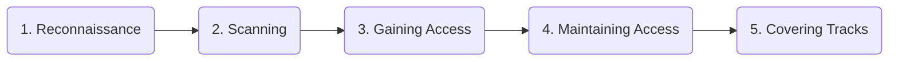

# 💻 Module 04: Ethical Hacking Labs

Welcome to the practical side! Ethical hacking is testing a system to find vulnerabilities before the bad guys do. **Always ensure you have explicit, written permission.**

---

## 🔄 The 5 Phases of Penetration Testing

---

## 🛠️ Essential Tools for Your Lab

To set up your personal hacking lab, you will need:
1. **VirtualBox / VMware:** For running virtual machines safely.
2. **Kali Linux:** The primary operating system for penetration testing.
3. **Nmap:** For network discovery and security auditing.
4. **Burp Suite:** For web application security testing.

---
⬅️ **[Back to Module 03](../03-Web-Application-Security/README.md)** | ➡️ **[Proceed to Module 05](../05-Tools-and-Resources/README.md)**
