# 🛡️ cybersecurity-learning-hub


Welcome to the **Advanced Cyber Security Masterclass**. This repository serves as an enterprise-grade learning path designed for individuals aiming to master Information Security, Red Teaming, and Blue Teaming architectures.

Unlike basic tutorials, this guide dives deep into enterprise security frameworks, advanced exploitation methodologies, and industry-standard defensive tactics.


---

## 🗺️ Course Roadmap

Follow this structured path to build your expertise from architectural foundations to advanced penetration testing.

```mermaid
graph LR;
    M1[01. Enterprise Architecture] --> M2[02. Network Defense];
    M2 --> M3[03. Web AppSec];
    M3 --> M4[04. Red Teaming Labs];
    M4 --> M5[05. Certs & Enterprise Tools];
    
    style M1 fill:#2b2d42,stroke:#edf2f4,stroke-width:2px,color:#fff
    style M2 fill:#457b9d,stroke:#edf2f4,stroke-width:2px,color:#fff
    style M3 fill:#1d3557,stroke:#edf2f4,stroke-width:2px,color:#fff
    style M4 fill:#e63946,stroke:#edf2f4,stroke-width:2px,color:#fff
    style M5 fill:#2a9d8f,stroke:#edf2f4,stroke-width:2px,color:#fff
```



---

## 📚 Curriculum & Modules

Navigate through the folders below to access the deep-dive materials for each phase of the masterclass:

* 🏛️ **[`01-Security-Fundamentals`](./01-Security-Fundamentals)**: Zero Trust Architecture (ZTA), Defense in Depth, and STRIDE Threat Modeling.
* 🌐 **[`02-Network-Security`](./02-Network-Security)**: Advanced TCP/IP analysis, SYN Floods, Stealth Nmap Scanning, and Next-Gen Firewalls (NGFW).
* 🕸️ **[`03-Web-Application-Security`](./03-Web-Application-Security)**: Blind SQL Injection, DOM-based XSS, Server-Side Request Forgery (SSRF), and IDOR.
* 💻 **[`04-Ethical-Hacking-Labs`](./04-Ethical-Hacking-Labs)**: The Cyber Kill Chain, Privilege Escalation (Linux/Windows), and the Metasploit Framework.
* 🛠️ **[`05-Tools-and-Resources`](./05-Tools-and-Resources)**: Enterprise tooling (Nessus, Splunk), OSCP/CISSP Certification Roadmaps, and Pro Lab setups.

---

## ⚙️ Prerequisites

To fully grasp the concepts in this repository, you should have:
* A solid understanding of basic networking (IP addresses, Subnets, DNS).
* Familiarity with the Linux command line and bash scripting.
* Basic understanding of web technologies (HTML, JS, HTTP methods).
* A dedicated virtual environment for safe testing.

---

## 🛠️ Your Lab Setup

Do not test on your host machine. You will need to build an isolated penetration testing lab.

| Tool | Purpose | Download Link |
| :--- | :--- | :--- |
| **VirtualBox / VMware** | Hypervisor for running target and attacker VMs safely. | [VirtualBox](https://www.virtualbox.org/) |
| **Kali Linux** | Industry-standard Attacker Operating System. | [Kali Linux](https://www.kali.org/) |
| **Burp Suite Pro/CE** | Advanced web vulnerability scanning and interception. | [PortSwigger](https://portswigger.net/burp) |
| **Wireshark** | Deep packet inspection and traffic analysis. | [Wireshark](https://www.wireshark.org/) |

---

## 🚀 How to Use This Repository

1.  **Star the Repo**: Click the ⭐ button at the top right to bookmark this masterclass.
2.  **Clone the Environment**: Download the notes to your local machine:
    ```bash
    git clone [https://github.com/YourUsername/YourRepositoryName.git](https://github.com/YourUsername/YourRepositoryName.git)
    cd YourRepositoryName
    ```
3.  **Execute the Path**: Start from Module 01 and progress chronologically. Ensure you practice the concepts in your local virtual machines before moving on.

---

## ⚠️ Disclaimer & Rules of Engagement

> **STRICT WARNING:** All information, techniques, vulnerabilities, and tools discussed in this repository are provided for **educational and defensive purposes only**. The author assumes no liability and is not responsible for any misuse, damage, or legal consequences caused by applying this information. 
> 
> You must **NEVER** scan, test, or exploit any system, network, or application without explicit, written, and legally binding permission from the owner. **Act like a professional. Be ethical, stay legal.**
